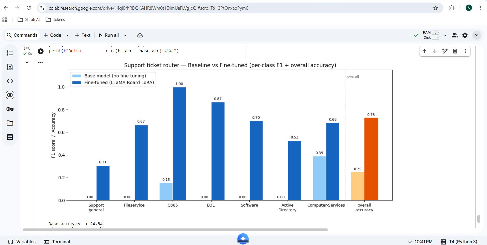
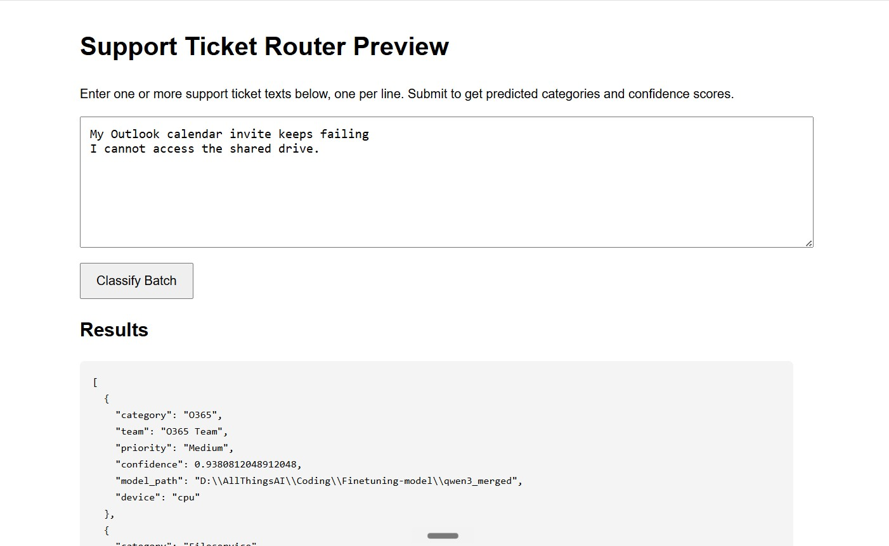

# Support Ticket Classifier with Qwen3

A notebook-to-service demo for fine-tuning a Qwen3 model to classify IT support tickets and route them to the right team.

This project begins with a notebook/Colab workflow for fine-tuning a Qwen3 model to classify IT support tickets. On top of that foundation, we added a small enhancement to make the learning experience more interactive and easier to demonstrate.

## Overview

The notebook trains a Qwen3-based router that can classify support tickets into categories such as O365, Fileservice, Active Directory, Software, EOL, Computer-Services, and Support general.

To make the result more tangible, we added a lightweight web-based inference layer so the trained model can be tested through a simple preview UI and API endpoints.

## What was added on top of the notebook workflow

The original notebook covered training, evaluation, and model merging. The extra piece we built on top of it is a minimal deployment-style add-on:

- A FastAPI service in app.py
- A classification endpoint: POST /classify
- A batch endpoint: POST /batch_classify
- A simple preview page: GET /preview
- A small visual demo to show model output clearly

This enhancement is intentionally lightweight, but it helps connect the training notebook to a usable application experience.

## Notebook run confirmation

The notebook was executed successfully, including the final evaluation cells. The image below shows the successful run confirmation.



## Preview UI and example response

The image below shows the preview interface and a sample classification response produced by the add-on.



This small interface makes the project easier to learn because it turns the model output into a simple, visible demo rather than leaving everything inside notebook cells.

## Why this add-on is useful

- Makes fine-tuning concepts easier to understand visually
- Shows how a trained model can be used after training, not only inside notebook cells
- Provides a simple way to test predictions without extra infrastructure
- Keeps the project approachable for learning and demo purposes

## Training flow

1. Prepare the support ticket dataset
2. Fine-tune Qwen3 with LoRA using LLaMA-Factory
3. Merge the LoRA adapter into a standalone model folder
4. Evaluate the model on validation data
5. Use the merged model in the inference service

## Project structure

- Finetune_Support_Ticket_Classifier_Qwen3.ipynb — main notebook workflow
- prepare_support_tickets.py — dataset preparation helper
- support_tickets.csv — labeled training data
- val_split.csv — validation split
- app.py — lightweight inference service
- qwen3_merged/ — merged model folder used by the service
- README.md — project documentation

## Run locally

### 1. Install dependencies

```bash
python -m pip install -r requirements.txt
```

### 2. Start the service

```bash
python app.py
```

### 3. Call the service

```bash
curl -X POST http://127.0.0.1:8080/classify \
  -H "Content-Type: application/json" \
  -d '{"text": "My Outlook calendar invite keeps failing."}'
```

### 4. Open the preview page

```text
http://127.0.0.1:8080/preview
```

## Example response

```json
{
  "category": "O365",
  "team": "O365 Team",
  "priority": "Medium",
  "confidence": 0.93,
  "model_path": "...\\Finetuning-model\\qwen3_merged",
  "device": "cpu"
}
```

## Notes

This repository combines two parts:

1. The original notebook-based fine-tuning workflow
2. A small deployment-style enhancement built on top of it so the model can be tested interactively

That combination makes the project a practical example for learning both fine-tuning and model-serving concepts.

## License

MIT
